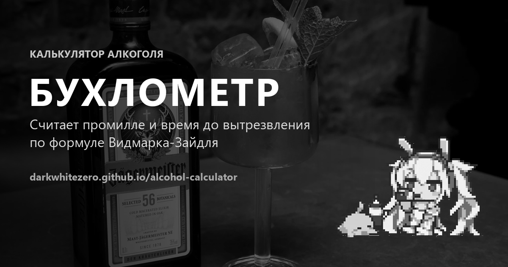

# 🍸 Бухлометр — калькулятор алкоголя

[](https://github.com/darkwhitezero/alcohol-calculator/stargazers)
[](./LICENSE)
[](https://github.com/darkwhitezero/alcohol-calculator/issues)
[](https://vuejs.org/)
[](https://www.typescriptlang.org/)



**Бухлометр** — простой юзер-френдли веб‑калькулятор, который оценивает концентрацию алкоголя в крови в **промилле (‰)** и примерное время до полного вытрезвления.
Расчёты основаны на формуле **Видмарка-Зайдля**.

> ⚠️ **Важно:** Бухлометр - это **не медицинские показания** и **не юридический инструмент**.
---

## 🚀 Демо

Приложение можно открыть по адресу:

- `https://darkwhitezero.github.io/alcohol-calculator/`

---

## ✨ Возможности

- ✅ Расчёт промилле (‰) по введённым данным (пол, вес, рост)
- ✅ Учёт наполненности желудка (пустой / перекус / плотный приём пищи)
- ✅ **Несколько напитков**: добавляй/удаляй позиции, меняй объём и крепость
- ✅ Пресеты напитков + "свой вариант"
- ✅ Примерная оценка состояния по диапазонам + наглядная шкала уровня опьянения
- ✅ Оценка времени до полного вытрезвления
- ✅ **Форма запоминается** между визитами (localStorage)
- ✅ **Поделиться результатом** — копирование в буфер обмена или ссылка с восстановлением введённых данных

---

## 🧮 Как происходит расчёт

1) Масса этанола (г):
`объём(мл) × (крепость/100) × 0.789`

2) Оценка BAC (от англ. Blood Alcohol Content, содержание алкоголя в крови) по формуле Видмарка:
`BAC ≈ (A / (r × m)) − β × t`

где:
- `A` — масса этанола (г)
- `m` — масса тела (кг)
- `r` — коэффициент распределения (зависит от пола и телосложения)
- `β` — скорость выведения (обычно ~**0.15 ‰/час**, но зависит от человека)
- `t` — время с момента употребления (часы)
---

## 🛠️ Технологии

Проект переехал с чистого JavaScript на **Vue 3 + TypeScript + Vite**:

- **Vue 3** (Composition API, `<script setup>`) — компоненты и реактивность вместо ручного управления DOM
- **TypeScript** (строгий режим) — типизированная логика расчёта и состояние формы
- **Vite** — сборка и dev-сервер
- **Vitest** — юнит-тесты расчётной логики

---

## 🚀 Запуск локально

```bash
npm install     # установить зависимости
npm run dev     # dev-сервер с горячей перезагрузкой
npm run build   # прод-сборка в dist/
npm run preview # локальный просмотр прод-сборки
npm run test    # юнит-тесты (Vitest)
npm run typecheck # проверка типов
```

---

## 📁 Структура проекта

```
index.html               — точка входа
src/
  main.ts                — запуск приложения
  App.vue                — корневой компонент
  lib/                    — чистая логика (без Vue): расчёт BAC, типы, константы,
                            сохранение в localStorage, "поделиться"
  composables/            — реактивное состояние формы (useCalculatorForm)
  components/             — компоненты интерфейса
  styles/                 — глобальные стили (чёрно-белая тема)
  assets/                 — фон и маскот-анимация (без фона, WebP)
public/                   — favicon, OG-превью
```

---

## ✅ Дисклеймер

Данный калькулятор предоставляет **лишь приблизительные расчёты**.
Он **не учитывает** индивидуальные особенности метаболизма, здоровье, лекарства, усталость и многие другие факторы.

Результаты **не имеют юридической силы** и не могут использоваться для оспаривания показаний алкотестера/освидетельствованием.
**Не садитесь за руль после употребления алкоголя**, даже если калькулятор показывает «0».

---

## ⭐ Поддержать проект

Если Бухлометр оказался полезным — поставь **звёздочку** репозиторию.
Это помогает проекту расти ❤️

---

## 📄 Лицензия

MIT — см. [LICENSE](./LICENSE).

---

## 🇬🇧 English

**Buhlometr** ("BAC-o-meter") is a small, friendly web calculator that estimates **Blood Alcohol
Content (BAC, ‰)** and the approximate time until you're sober again, using the **Widmark-Seidl
formula**. Built with **Vue 3 + TypeScript + Vite**. Not a medical or legal tool — never drive
after drinking, even if the calculator shows "0".

Live demo: `https://darkwhitezero.github.io/alcohol-calculator/`
